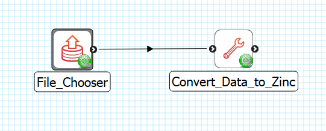

File Chooser
============

Overview
--------

The **File Chooser** is MAP Client plugin for choosing a file from a location outside the workflow.

Workflow Connections
--------------------

As shown in :numref:`fig-mcp-file-chooser-workflow-connections`, the **File Chooser** does not need any input.

It produces 1 output which may be piped to other workflow steps:

1. A location where the file is on the local disk. (Port: *http://physiomeproject.org/workflow/1.0/rdf-schema#file_location*) 

.. _fig-mcp-file-chooser-workflow-connections:

   **File Chooser** workflow connections.

Configure
---------

This step is used for choosing a file on the local disk from outside the workflow directory.
This step provides a *http://physiomeproject.org/workflow/1.0/rdf-schema#file_location* to define the location where the file is on the local disk.
To choose the file use the *...* button to open a file chooser dialog.
The *File* input is used to hold the relative path from the workflow to the input file location.

.. _fig-mcp-file-chooser-configure-dialog:

.. figure:: _images/step-configuration-dialog.png
   :alt: Step configure dialog

   *File Chooser* step configuration dialog.
